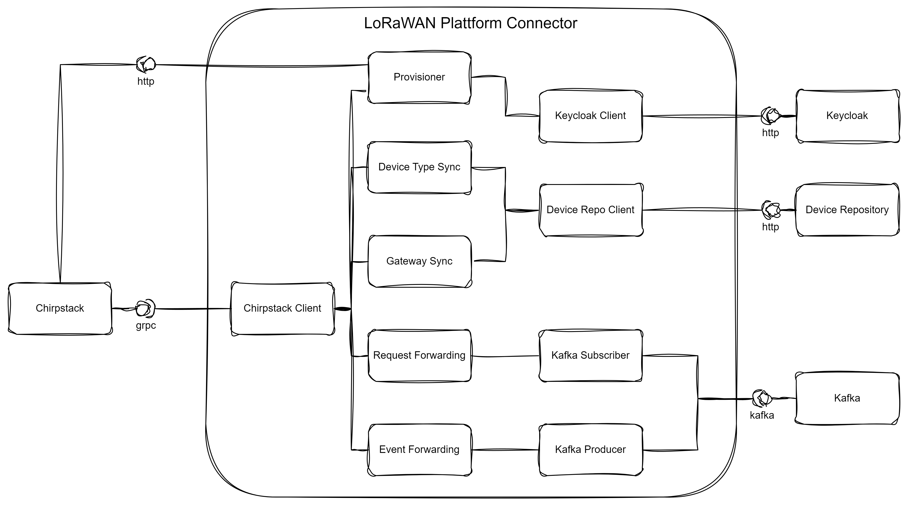

# LoRaWAN Platform Connector

Architecture diagram:

## TODOs

- Automatic provisioning for existing/missed users on startup (and periodic sync)
- Deletion of tenants on user removal
- Gateway sync
- Device Type (profile) sync
- Device sync
- Event forwarding to kafka
- Request forwarding